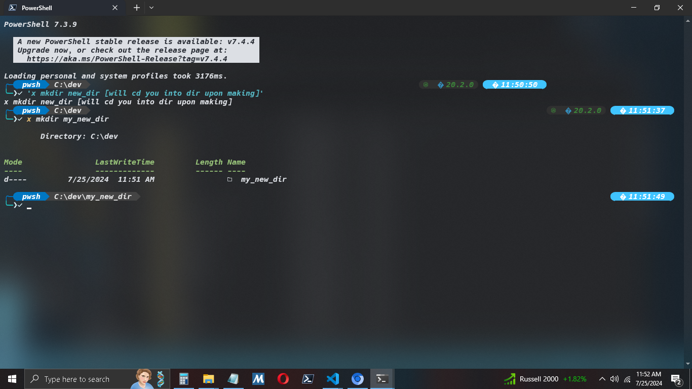

# x (for terminal)

CD into any dir simultaneously during Make command.
Save time by not having to cd 'intomydir'

mkdir myfoldername;
cd myfoldername;
becomes =>
x mkdir myfoldername

rails new myapp;
cd myapp;
becomes =>
x rails new my app

Enjoy
